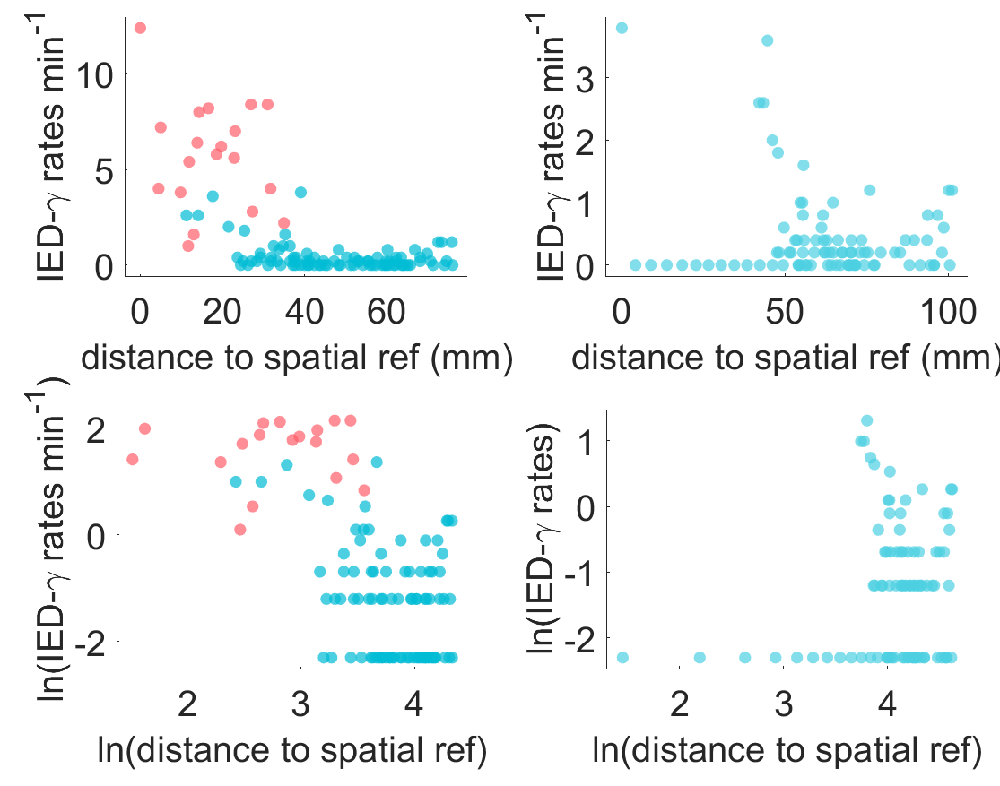

# Spatial-Perturbation-Framework

## Table of Contents
  * [Folders](#folders)
  * [Prerequisites](#prerequisites)
  * [Installation](#installation)
  * [Expected runtime](#expected-runtime)
  * [Getting started](#getting-started)
  * [Running the SP framework on your own data](#running-the-SP-framework-on-your-own-data)
  * [Reproducing results](#reproducing-results)
  * [Expected output](#expected-output)
  * [References](#references)

## Folders
```bash
.
├── LICENSE
├── README.md
├── demo_data
│   ├── P4_sample.mat
│   ├── P58_sample.mat
│   └── patient_data.mat
├── figures
│   ├── rSP_output_P4.png
│   ├── rSP_output_P58.png
│   └── vSP_output_P4.png
├── functions
│   ├── boxplot_gramm.m
│   ├── dunns.m
│   ├── plotFeatureSpace.m
│   ├── scatter_gramm.m
│   └── sphereIntersection.m
├── perturbation
│   ├── computeCorrelation.m
│   ├── computeSPMap.m
│   ├── train_kmeans.m
│   └── virtualRemovalSP.m
├── rSP_demo.m
├── results_figures
│   ├── figure3_4_perturbation_analysis.m
│   ├── figure6_sp_map_examples.m
│   ├── figure7_cluster_analysis.m
│   ├── figure8_9_covariate_analysis.m
│   └── sp_results
│       ├── SPMap_features.mat
│       ├── sp_maps.mat
│       └── virtual_removal_perturbation.mat
├── results_pipeline.m
├── spike_gamma_code
│   ├── computeSpikeGamma.m
│   ├── compute_gamma.m
│   ├── compute_spike_boundary.m
│   ├── postprocessing_v2.m
│   └── spike_detector_hilbert_v25.m
└── vSP_demo.m
```

## Prerequisites
- MATLAB R2023a or higher
- The following MATLAB add-ons need to be installed:
    - 'Curve Fitting Toolbox'
    - 'Image Processing Toolbox'
    - 'Signal Processing Toolbox'
    - 'Statistics and Machine Learning Toolbox'
    - 'Wavelet Toolbox'
    - 'gramm': https://github.com/piermorel/gramm
- Windows, macOS, or Linux operating system

## Installation
Download the repository into your local computer using the following command  
```bash 
git clone https://github.com/KassemJaber/Spatial-Perturbation-Framework.git
```
Install each prerequisite by first opening MATLAB R2023a, navigate to Home->Add-ons->Get Add-ons. Type in the name of each respective toolbox in the search bar and install.

Typical install time: 2 hours

## Expected runtime
Time to run ```vSP_demo.m```: 21.774976 seconds  
Time to run ```rSP_demo.m```: 22.131166 seconds


## Getting started
Set MATLAB workspace to repository folder, and get started by running the demo scripts on the sample data

```vSP_demo.m ```  
```rSP_demo.m ```  

Which provides an example of the complete end-to-end pipeline from the SEEG to the final result. The demo scripts will use five-minute SEEG data of two patients sampled from our MNI dataset. They have been downsampled to 200Hz to reduce file size so that it meets the file size limitations of GitHub. These samples can be found in the following subdirectory
```bash
demo_data
├── P4_sample.mat
├── P58_sample.mat
└── patient_data.mat
```
```patient_data.mat``` is a MATLAB struct with the variable name ```patient``` containing the following fields  
- Patient index
- ```channel_name```: Nx1 string array of channel labels
- ```sampling_freq```: 1x1 double containing the sampling frequency (in Hz)
- ```soz_ez```: Nx4 cell array
	- Column 1: Channel labels
   	- Column 2: 0: non-SOZ, 1: SOZ, 10: extracerebral, 30: marked as artifact
	- Column 3: 0: non-Resected, 1: resected, 10: extracerebral, 30: marked as artifact
	- Column 4: 0: non-SOZ and not resected, 1: SOZ and resected, 10: extracerebral, 30: marked as artifact
- ```engel```: 1x1 string with the surgical outcome of the patient
- ```channelRegions```: Nx1 string array of channel regions defined in the MICCAI atlas
- ```extraCerebral```: Mx1 string array of extracerebral channels
- ```MNI```: Nx3 double array of three dimensional channel coordinates
- ```spike_gamma_rates```: Nx6 double array of IED-gamma rates computed for each channel in six segments of the one hour interictal data 

## Running the SP framework on your own data
The main code of interest for the user to apply the framework can be found in the following subdirectory
```bash
perturbation
├── computeCorrelation.m
├── computeSPMap.m
├── train_kmeans.m
└── virtualRemovalSP.m
```
Which contains functions to apply the virtual-removal spatial perturbation framework (```virtualRemovalSP.m```), the ranked spatial perturbation framework (```computeSPMap.m```), and train your own unsupervised model (```train_kmeans.m```). 

If you wish to apply our method on your data, please consider the following steps: 
1. Extract the segment of interest from available SEEG data
2. Apply the bipolar montage on the signal
3. Preprocess the data with a notch filter and bandpass filter
4. Remove extracerebral white matter and artifact channels
5. Apply Janca detector (Janca et al., 2015) to detect interictal epileptiform discharges in the SEEG (see ```spike_detector_hilbert_v25.m```)
6. Apply postprocessing code (see ```postprocessing_v2.m```) to remove false detections due to artifacts and spindles
7. Run the spike-gamma code (Thomas et al., 2023) to determine if each IED has signficiant gamma activity preceding its onset (see ```computeSpikeGamma.m```)
8. Extract channel coordinates by coregisteration of post-implantation MRI (Zelmann et al., 2023)
9. Run the spatial perturbation framework! (see ```virtualRemovalSP.m``` and ```computeSPMap.m```)
    
## Reproducing results

```results_pipeline.m``` runs all the scripts to produce all the results in the manuscript.
The scripts to reproduce the result figures in the manuscript can be found in the following directory

```bash
results_figures
├── figure3_4_perturbation_analysis.m
├── figure6_sp_map_examples.m
├── figure7_cluster_analysis.m
├── figure8_9_covariate_analysis.m
└── sp_results
    ├── SPMap_features.mat
    └── virtual_removal_perturbation.mat
```

The folder **sp_results** contains the results of the framework applied  on all the patients in our dataset  
- ```virtual_removal_perturbation.mat``` contains the results of virtual removal SP framework.  
    - ```data```: 76x6 cell array containing the following data for all patients  
        1. Patient index (e.g., P4)
        2. MRI positive/negative
        3. $\bar{\rho}_{BR,i}$
        4. $\bar{\rho}_{AR,i}$
        5. $\bar{\rho}_{RR,i}$
        6. Surgical outcome (seizure-free=1; non-seizure-free=2)
        7. Center (MNI=1; CHUGA=2)
           
- ```SPMap_features.mat``` contains the results of the rSP framework  
    - ```feature``` 76x5 cell array containing the following data for all patients:
        1. Mean of positive perturbation strengths in Quadrant 1
        2. Mean of positive perturbation strengths in Quadrant 2
        3. Mean of positive perturbation strengths in Quadrant 4  
        4. Surgical outcome (seizure-free=1; non-seizure-free=2)  
        5. Center (MNI=1; CHUGA=2)
    - ```covariates``` contains the following clinical covariates
        1. SOZ volume
        2. Resected volume
        3. Resected SOZ volume
        4. Percent SOZ removed
        5. Patient has a complete resection as marked by a clinician (complete resection=1, incomplete=0) 

Simply press _run_ on any of the scripts and it should work on it's shown. You will need to change a couple variables to produce center specific results (found at the beginning of each script).  

## Expected output
When running ```vSP_demo.m```, you should expect the following results when choosing ```patient_number=1``` (i.e., P4)  
<p align="center">
  
</p> 
Which illustrates the constructed spatial system before virtual removal of the SOZ (left), and the perturbed spatial system after virtually removing the SOZ (right).  

Running the demo script ```rSP_demo.m``` will produce the SP maps for one of the two patient. The algorithm outputs the following for ```patient_number = 1``` (left), and ```patient_number = 2``` (right)

<p align="center" float="left">
  
  
</p>  

Which illustrates the spatial ranking of each channel's perturbation strength.

## References
* Janca, R., Jezdik, P., Cmejla, R. et al. Detection of Interictal Epileptiform Discharges Using Signal Envelope Distribution Modelling: Application to Epileptic and Non-Epileptic Intracranial Recordings. Brain Topogr 28, 172–183 (2015). https://doi.org/10.1007/s10548-014-0379-1
* Thomas, J., Kahane, P., Abdallah, C., Avigdor, T., Zweiphenning, W.J.E.M., Chabardes, S., Jaber, K., Latreille, V., Minotti, L., Hall, J., Dubeau, F., Gotman, J. and Frauscher, B. (2023), A Subpopulation of Spikes Predicts Successful Epilepsy Surgery Outcome. Ann Neurol, 93: 522-535. https://doi.org/10.1002/ana.26548
* Zelmann R, Frauscher B, Aro RP, Gueziri HE, Collins DL. SEEGAtlas: A framework for the identification and classification of depth electrodes using clinical images. J Neural Eng. 2023 May 31;20(3). doi: 10.1088/1741-2552/acd6bd. PMID: 37201515.
